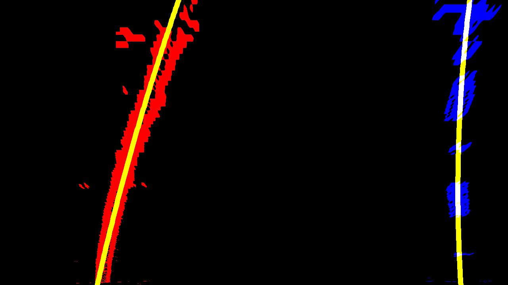
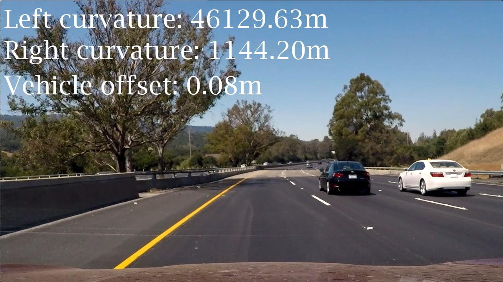
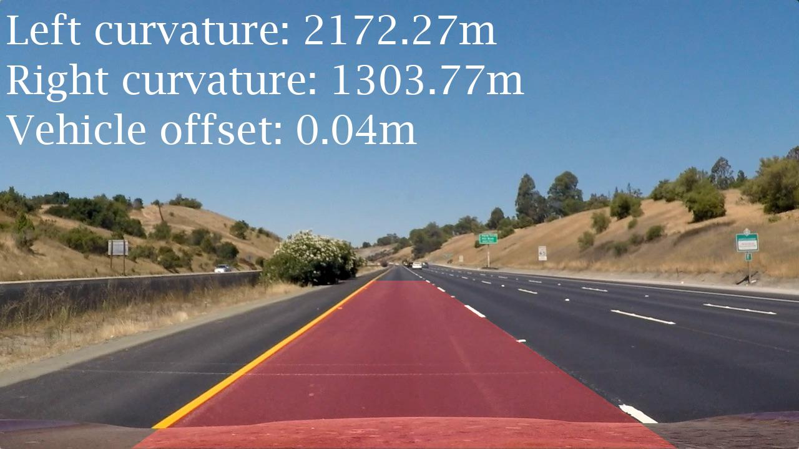
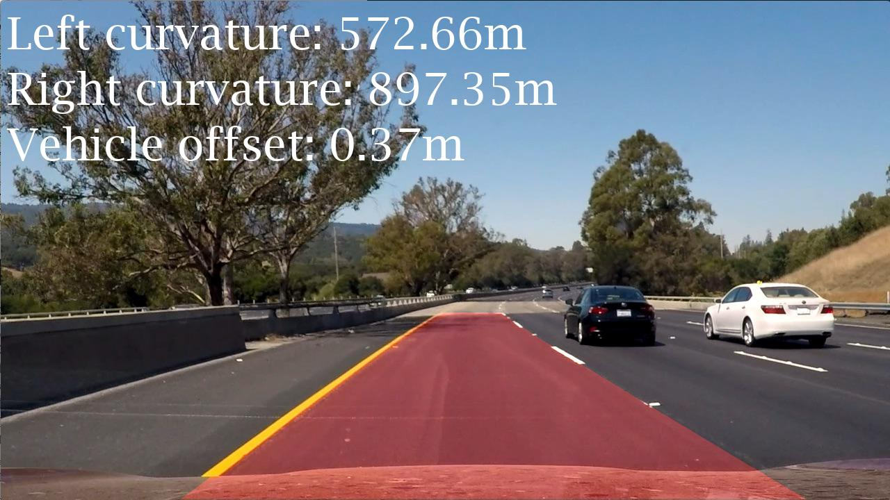

# **Advanced Lane Lines **

## Writeup by Matthew Jones

### Project: CarND-Advanced-Lane-Lines-P2
---

**Advanced Lane Finding Project**

The goals / steps of this project are the following:

  1. Compute the camera calibration matrix and distortion coefficients given a set of chessboard images.
  2. Apply a distortion correction to raw images.
  3. Use color transforms, gradients, etc., to create a thresholded binary image.
  4. Apply a perspective transform to rectify binary image ("birds-eye view").
  5. Detect lane pixels and fit to find the lane boundary.
  6. Determine the curvature of the lane and vehicle position with respect to center.
  7. Warp the detected lane boundaries back onto the original image.
  8. Output visual display of the lane boundaries and numerical estimation of lane curvature and vehicle position.
  9. Run project videos of a car driving down the freeway through the image processing pipeline.
 10. Discuss challenging aspects of the project.

## Image References

|1. Chessboard corners identified |2. Straight road undistorted |
| | |
|3. Combined thresholds transformed |4. Perspective transformed to birds-eye view |
| | |
|5. Lane pixels and line of best fit identified |6. Lane curvature and vehicle offset calculated |
| | |
|7. Lane boundaries overlayed |8. Lane curvature and vehicle offset position overlayed|
| | |
|9. Project video processed | |
|<video src="./output_videos/ALL_project_video.mp4"> ||

## [Rubric Points](https://review.udacity.com/#!/rubrics/571/view)

### Here I will consider the rubric points individually and describe how I addressed each point in my implementation.  

---

### Writeup 

### Camera Calibration

#### 1. Briefly state how you computed the camera matrix and distortion coefficients. Provide an example of a distortion corrected calibration image.

The code for this step is contained in the first section of the IPython notebook "P2.ipynb" 

I start by preparing "object points", which will be the (x, y, z) coordinates of the chessboard corners in the world. Here I am assuming the chessboard is fixed on the (x, y) plane at z=0, such that the object points are the same for each calibration image.  Thus, `objp` is just a replicated array of coordinates, and `objpoints` will be appended with a copy of it every time I successfully detect all chessboard corners in a test image.  `imgpoints` will be appended with the (x, y) pixel position of each of the corners in the image plane with each successful chessboard detection.  

I then used the output `objpoints` and `imgpoints` to compute the camera calibration and distortion coefficients using the `cv2.calibrateCamera()` function.  I applied this distortion correction to the test image using the `cv2.undistort()` function and obtained this result: 

**Calibrated Camera Images**
 

### Pipeline (single images)

#### 2. Provide an example of a distortion-corrected image.

The code for this step is in the second section of the IPython notebook "P2.ipynb" 
I get the matrix and distortion coefficients calculated in step 1 (camera calibration using chessboard images) by calling function "cal_undistort()" and apply them to road images using function "cv2.undistort()" against images in folder "test_images"

#### 3. Describe how (and identify where in your code) you used color transforms, gradients or other methods to create a thresholded binary image.  Provide an example of a binary image result.

The code for this step is in the third section of the IPython notebook "P2.ipynb" 
I used a combination of color threshold and combined gradient thresholds to generate a binary image (thresholding steps at lines on color channel [s_thresh = (170,255)] and on X gradient [x_thresh = (20,100)]
Here's an example of my output for this step. 

#### 4. Describe how (and identify where in your code) you performed a perspective transform and provide an example of a transformed image.

The code for this step is in the fourth section of the IPython notebook "P2.ipynb". 

My perspective transform uses a hard coded points from a straight line view of the road "test_images/straight-line1.jpg" and after undistortion converts to a top-down perspective view using four corners of a polygon and converting to top-down view using an offset and verified by printing the result of a perspective transform.

This resulted in the following source and destination points:

| Source        | Destination   | 
|:-------------:|:-------------:| 
| 600, 450      | 450, 0        | 
| 700, 450      | 830, 0        |
| 1100, 720     | 830, 720      |
| 200, 720      | 450, 720      |

#### 5. Describe how (and identify where in your code) you identified lane-line pixels and fit their positions with a polynomial?

The code for this step is in the fifth section of the IPython notebook "P2.ipynb". 
Starting with the warped images that have been undistorted and perspective transformed to top-down view in grayscale.
The lower half of the image is selected and a histogram analysis of left to right view of the image to find peaks of active (white) pixel destiny.
Mid-points of left and right side of the image are marked as starting points then a series of small windows are drawn from bottom to top of image with a boundary line. Then active (white) pixels within the window are identified and added to list of left-side and right-side pixels. Then the next window is scanned for pixels and if is above a minimum then the window is re-centered on the current position and the active pixels added to the left-side and right-side lists.
The lists of left-side and right-side pixels are then passed to the polyfit() function to identify best fit polynomial function.
Then left-side pixels are painted red and right-side painted blue and best-fit polynomial line is drawn across the images.

#### 6. Describe how (and identify where in your code) you calculated the radius of curvature of the lane and the position of the vehicle with respect to center.

The code for this step is in the sixth section of the IPython notebook "P2.ipynb". 
The warped images are passed to function measure_curvature_real() which in turn calls fit_polynomial() and returns the lists of left-side and right-side pixels which are used to calculate the curvature in metres and the vehicle bias.

output_images/warped_00.jpg
Left:  9072.60 m   Right:  13933.05 m
Vehicle Bias:  0.0370 

#### 7. Provide an example image of your result plotted back down onto the road such that the lane area is identified clearly.

The code for this step is in the seventh section of the IPython notebook "P2.ipynb". 

Function overlay() takes the lists of pixels that fit the left-side and right-side curvature lines, plots them back on the undistorted images and prints the curvatures and vehicle bias. Here is an example of my results on a test image:

#### 8. Show sequences of images getting successfully processed by the pipeline

The code for this step is in the eighth section of the IPython notebook "P2.ipynb". 

---

### Pipeline (video)

#### 9. Provide a link to your final video output.  Your pipeline should perform reasonably well on the entire project video (wobbly lines are ok but no catastrophic failures that would cause the car to drive off the road!).

The code for this step is in the eighth section of the IPython notebook "P2.ipynb". 
Here's a [link to my video result](./project_video.mp4)

---

### Discussion

#### 10. Briefly discuss any problems / issues you faced in your implementation of this project.  Where will your pipeline likely fail?  What could you do to make it more robust?

Quite a few!!! Here's where I got stuck.
(3) Combining gradient and color transforms to show respective pixels on blue and green channels on the same image
(5) Getting the pixels to show red and blue and then drawing the line of best fit on top
(7) Getting the curvatures and overlays to display on the correct test_images; I had a number of isssues with lists getting out of order. Getting the pipeline function to run through all the main functions top to bottom in order.
(8) Processing the video; does not seem to work on my local Jupyter/Conda install

After 4 or 5 days trying to get my own code running, I reference/re-used a lot of the code here:

https://github.com/waterwheel31/SD_advanced_lane_finding/blob/master/Advanced_Lane_Line_Detection.ipynb

