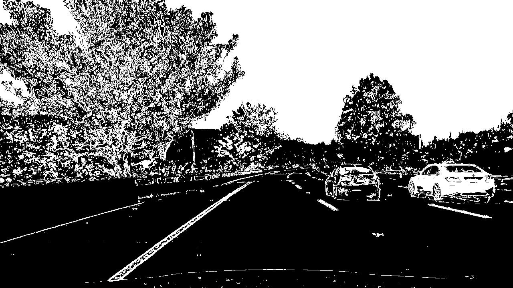
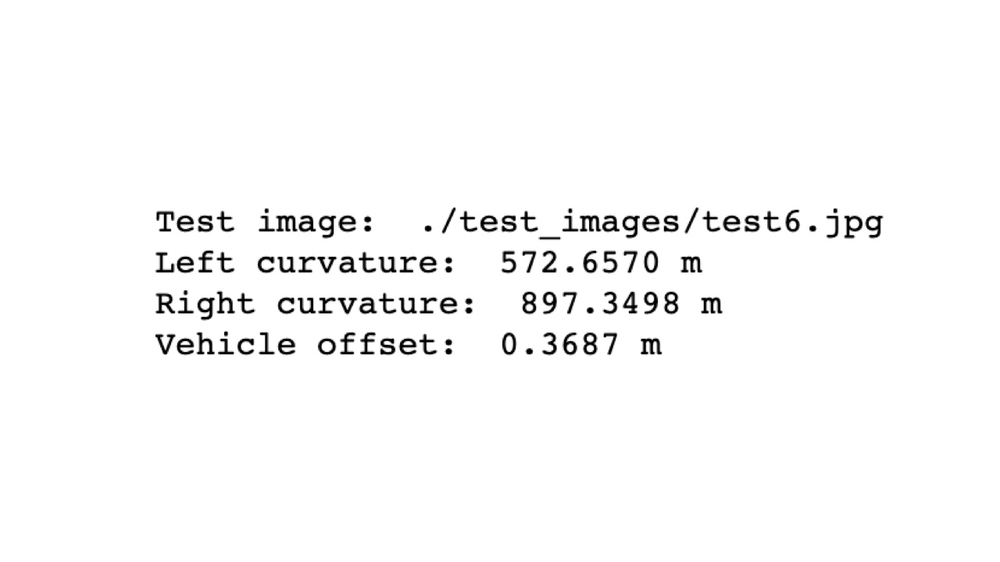
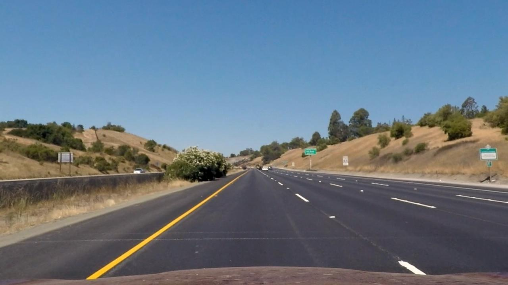
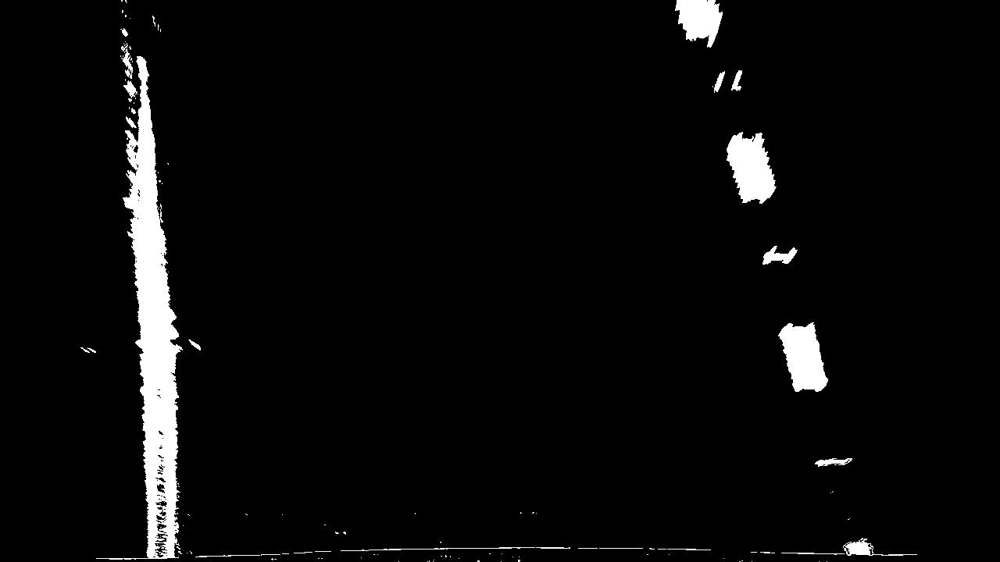

# Advanced Lane Lines

## Writeup by Matthew Jones

### Project: CarND-Advanced-Lane-Lines-P2
---

**Advanced Lane Finding Project**

The goals / steps of this project are the following:

  1. Compute the camera calibration matrix and distortion coefficients given a set of chessboard images.
  2. Apply a distortion correction to raw images.
  3. Use color transforms, gradients, etc., to create a thresholded binary image.
  4. Apply a perspective transform to rectify binary image ("birds-eye view").
  5. Detect lane pixels and fit to find the lane boundary.
  6. Determine the curvature of the lane and vehicle position with respect to center.
  7. Warp the detected lane boundaries back onto the original image and show estimate of lane curvature and vehicle position.
  8. Run project videos of a car driving down the freeway through the image processing pipeline.
  9. Discuss challenging aspects of the project.

## Image References

|1. Chessboard corners identified |2. Curved road undistorted |
|:---:|:---:|
| | |
|3. Combined thresholds transformed |4. Perspective transformed to birds-eye view |
| | |
|5. Lane pixels and line of best fit identified |6. Lane curvature and vehicle offset calculated |
| | |
|7. Lane boundaries, curvature and vehicle offset overlayed |8. Project video processed |
| | |

## [Rubric Points](https://review.udacity.com/#!/rubrics/571/view)

### Here I will consider the rubric points individually and describe how I addressed each point in my implementation.  

---

### Writeup 

### Camera Calibration

#### 1. Briefly state how you computed the camera matrix and distortion coefficients. Provide an example of a distortion corrected calibration image.

The code for this step is contained in the first section of the IPython notebook __P2.ipynb__ and __calibrate_camera.py__ and __distortion.py__ python files. 

Camera calibration is done by loading the calibration images at __camera_cal/calibrate*.jpg__ and running grayscale versions through _cv2.findChessboardCorners()_. Corners are drawn on these images using _cv2.drawChessboardCorners()_ and saved as output to __camera_cal/corners*.jpg__.  *objpoints* and *imgpoints* arrays are passed to _cv2.calibrateCamera()_ which returns the distortion coefficients and matrix needed to undistort the image.  Distortion matrix and coefficients are stored in a pickle file so that they can be re-used throughout the project to undistort images. This is done by instantiating a __Distortion__ object from the the pickle file and calling __undistort()__ which uses _cv2.undistort()_ to undistort the image. An example camera calibration chessboard image that have been undistorted by loading the Distortion object and calling __undistort()__ is shown below. 
 

 
*A full set of undistorted camera calibration images are available here:* __./camera_cal/undistort*.jpg__
 

### Pipeline (single images)

#### 2. Provide an example of a distortion-corrected image.

The code for this step is in the second section of the IPython notebook __P2.ipynb__, __calibrate_camera.py__ and __distortion.py__ python file.

Here is an example of __test_images/straight_lines1.jpg__ undistorted by loading the Distortion class object and calling __undistort()__ method. Distortion class loads the camera calibration matrix and distortion coefficients from the pickle file as explained above.
 

 
*A full set of undistorted test_images are available here:* __./output_images/undistort_*.jpg__
 

#### 3. Describe how (and identify where in your code) you used color transforms, gradients or other methods to create a thresholded binary image.  Provide an example of a binary image result.

The code for this step is in the third section of the IPython notebook __P2.ipynb__ and __combined_thresholds.py__ python file.
A combination of gradient threshold and color threshold functions were applied to generate a binary image in which lines could be more easily identified. A combination of transforms were made using absolute Sobel gradient threshold on the X and Y gradients, Saturation threshold on the S channel of HLS colorspace and  Red threshold on the R channel or RGB colorspace. Through experimentation Magnitude and Direction gradient threshold transforms were found to be ineffective. Here are some examples of my output from this step. 
 

 
*A full set of threshold transformed test_images are available here:* 
**./output_images/threshold_*.jpg**
 

#### 4. Describe how (and identify where in your code) you performed a perspective transform and provide an example of a transformed image.

The code for this step is in the fourth section of the IPython notebook __P2.ipynb__ and __birdseye.py__. 

BirdsEyeView class includes methods to transform the perspective of any image to or from a birds-eye view using class methods that use __cv2.getPerspectiveTransform()__ and __cv2.warpPerspective()__. My perspective transform uses a hard coded set of polygon points from the straight line view of the road __./test_images/straight-line1.jpg__ to a top-down perspective birds-eye view. These points were then verified and adjusted after outputting the results to the screen.

The following source and destination points were used to feed the transform methods.
 
| Source        | Destination   | 
|:-------------:|:-------------:| 
| 600, 450      | 200, 0        | 
| 700, 450      | 1000, 0       |
| 1020, 660     | 1020, 660     |
| 210, 720      | 210, 720      |
 

 
*A full set of birds-eye perspective transformed images are available here:* 
**./output_images/birdseye_threshold_*.jpg**
 

#### 5. Describe how (and identify where in your code) you identified lane-line pixels and fit their positions with a polynomial?

The code for this step is in the fifth section of the IPython notebook __P2.ipynb__ and __detect.py__ and __lanes.py__ and __lane.py__ python files. 
This step begins with an image that have already been undistorted and transformed using combined threshold and birds-eye perspective functions.

The lower half of the image is selected and a histogram analysis is performed on the  left to right view to find peaks of active (white) pixel destiny.
Mid-points of the left and right sides of the image are marked as starting points then a series of small windows are drawn from bottom to top of image with a boundary line. For every window, active (white) pixels are identified and added to the lists of left-side and right-side pixels and then the next window is scanned for pixels. If the length of the left-side and right-side pixel arrays are above a minimum then the window is re-centered on their current positions. And then the active pixels are added to the left-side and right-side lists. The lists of left-side and right-side pixels are used to instantiate left-side and right-side Lane objects which are held in memory. *P2.ipnyb* then shows the images with sliding windows and lane line images with left-lane pixels painted red, right-lane pixels painted blue. 

And then on top of each lane lime image, PixelCalculation class method of the left and right Lane objects wich in-turn calls functions *np.polyfit()*, *np.poly1d()* and *np.polyder()* to find the line of best fit polynomial which is then plotted on top of the left and right lane lines and painted yellow using *np.linspace()*.
 

 

*A full set of images with lane pixels identifed and best-fit line are shown in the P2.ipynb notebook and also available here:* 
**./output_images/lanes_*.jpg**
 

#### 6. Describe how (and identify where in your code) you calculated the radius of curvature of the lane and the position of the vehicle with respect to center.

The code for this step is in the sixth section of the IPython notebook "P2.ipynb". 
The warped images are passed to function measure_curvature_real() which in turn calls fit_polynomial() and returns the lists of left-side and right-side pixels which are used to calculate the curvature in metres and the vehicle bias.

output_images/warped_00.jpg
Left:  9072.60 m   Right:  13933.05 m
Vehicle Bias:  0.0370 

#### 7. Provide an example image of your result plotted back down onto the road such that the lane area is identified clearly.

The code for this step is in the seventh section of the IPython notebook "P2.ipynb". 

Function overlay() takes the lists of pixels that fit the left-side and right-side curvature lines, plots them back on the undistorted images and prints the curvatures and vehicle bias. Here is an example of my results on a test image:

---

### Pipeline (video)

#### 8. Provide a link to your final video output.  Your pipeline should perform reasonably well on the entire project video (wobbly lines are ok but no catastrophic failures that would cause the car to drive off the road!).

The code for this step is in the eighth section of the IPython notebook "P2.ipynb". 
Here's a [link to my video result](./project_video.mp4)

---

### Discussion

#### 9. Briefly discuss any problems / issues you faced in your implementation of this project.  Where will your pipeline likely fail?  What could you do to make it more robust?

Quite a few!!! Here's where I got stuck.
(3) Combining gradient and color transforms to show respective pixels on blue and green channels on the same image
(5) Getting the pixels to show red and blue and then drawing the line of best fit on top
(7) Getting the curvatures and overlays to display on the correct test_images; I had a number of isssues with lists getting out of order. Getting the pipeline function to run through all the main functions top to bottom in order.
(8) Processing the video; does not seem to work on my local Jupyter/Conda install

After 4 or 5 days trying to get my own code running, I reference/re-used a lot of the code here:

https://github.com/waterwheel31/SD_advanced_lane_finding/blob/master/Advanced_Lane_Line_Detection.ipynb

